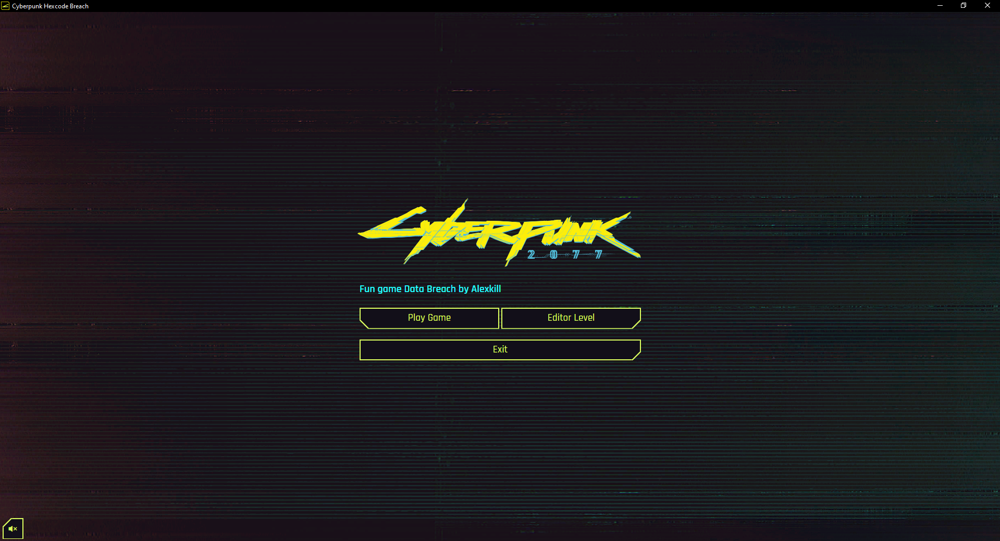
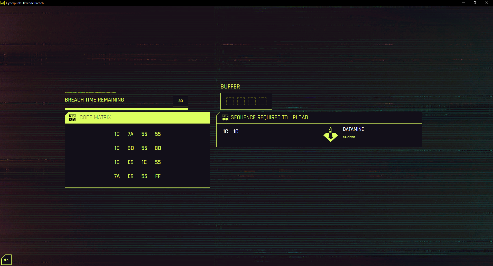
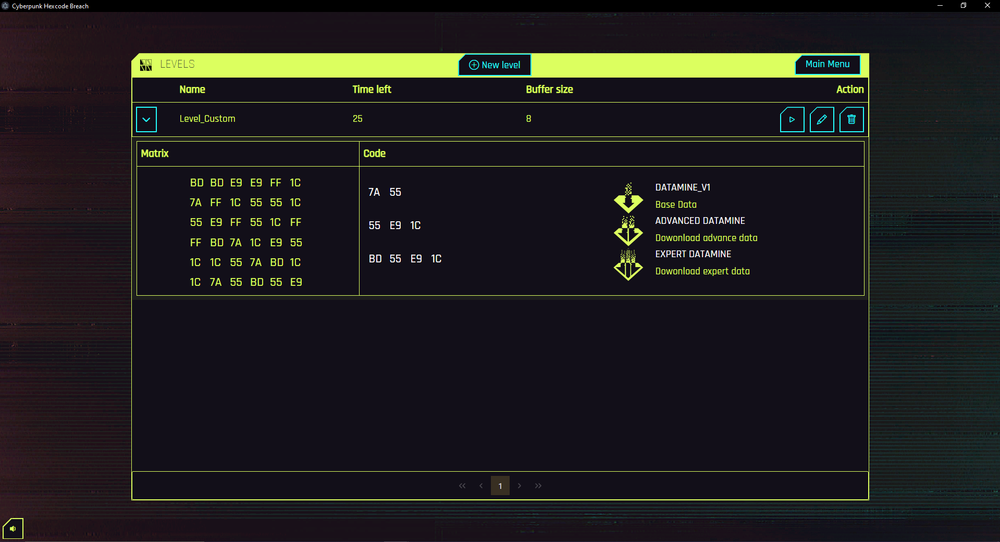
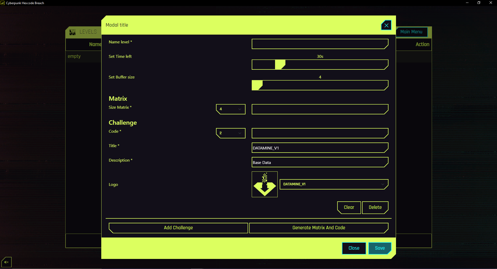

# Cyberpunk Hexcode Breach

### Description:

This is a fun made replica of the Breach protocol minigame from Cyberpunk 2077® owned by CD Project Red®.
The repilica was made based on version 2.0 of the original game and tries to be as faithful to the original as possible.
This project was born with the purpose of creating a tool that would be training for digital gaming and to be used in Cyberpunk 2020® and Cyberpunk RED® role-playing game campaigns as well.

### Features:

* Play Original Game
* Incremental Dificulty
* Infiniti Play
* Make Custom Level
* Platform Support Windows / MacOS / Linux

###### Menu

###### Game

###### Custom Level List

###### Editor Level

## Release

Versione V1.0: [Download](https://github.com/Alexkill536ITA/cyberpunk-hexcode-breach/releases/tag/Release-V1.0.1)

## Development

### Dependencies:

* This project was generated with [Angular CLI](https://github.com/angular/angular-cli) version 16.2.12.
* Used [Node.js](https://nodejs.org/en) version [20.10.0 Iron](https://nodejs.org/download/release/v20.10.0/).
* Include Module [Electron](https://www.electronjs.org/docs/latest/) framework version 31.1.0.

Install NPM dependencies use comand `npm i`

##### Debug Angular:

Run `ng serve` for a dev server. Navigate to `http://localhost:4200/`. The application will automatically reload if you change any of the source files.

##### Debug Electron:

Run `npm electron-build` for a dev auto build Angular project and open window desktop APP

## Build

##### Build Only Angualr:

Run `ng build` to build the project. The build artifacts will be stored in the `dist/` directory.

##### Buil Desktop APP by Electron:

* Run command `npm run` `package-win` or `package-win-64` buil version Windows 32/64bit.
* Run command `npm run package-linux` buil version Linux.
* Run command `npm run package-mac` buil version MacOS.
* Run command `npm run package-all` buil all distributions.

Output to directory folder `builds/`
